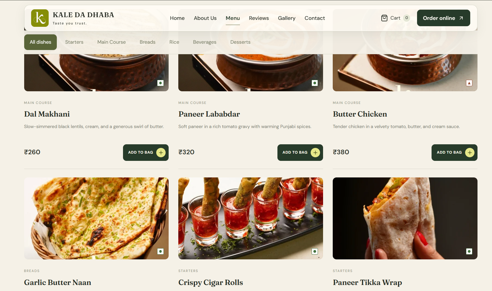
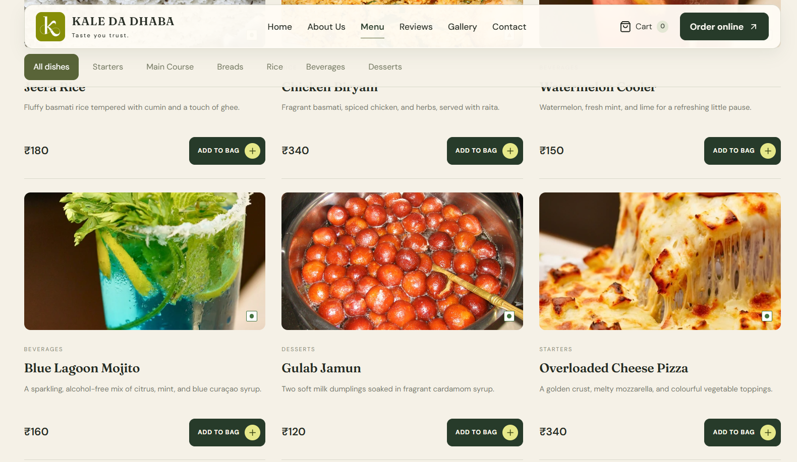
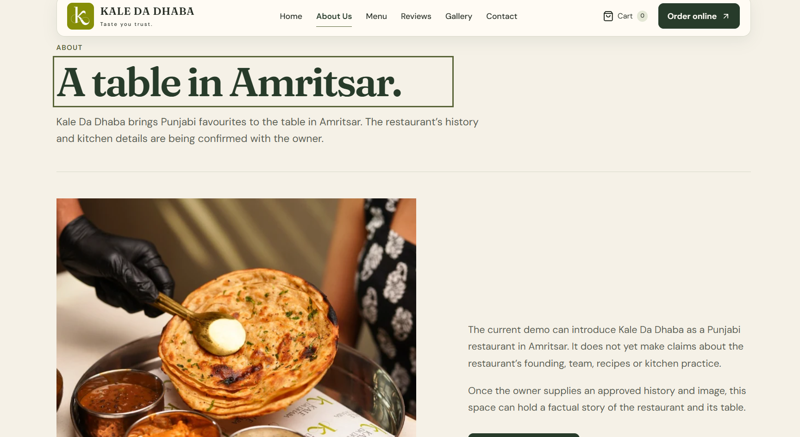
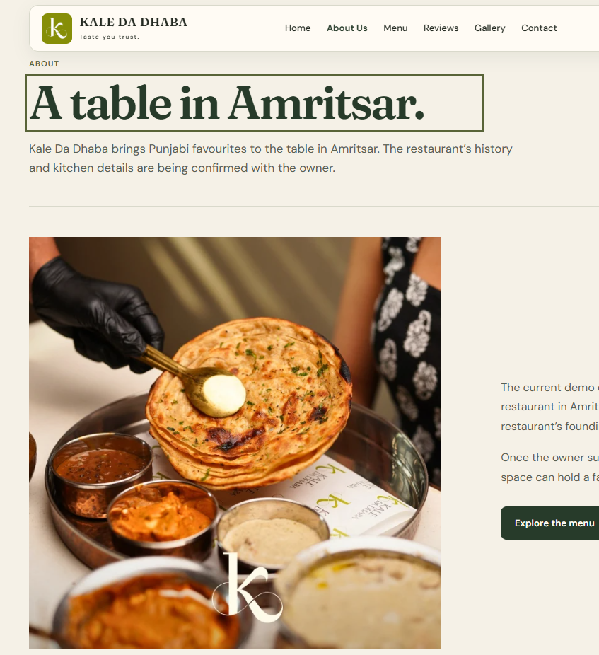
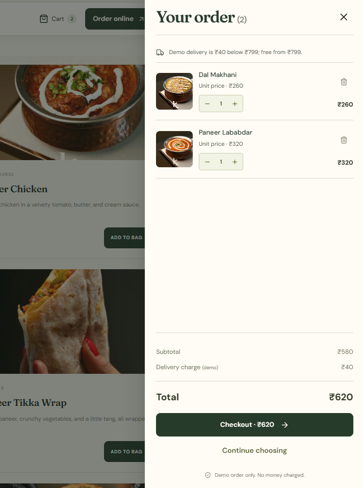

# Kale Da Dhaba — Local Ordering Showcase

> **Suggested project name:** Kale Da Dhaba — Local Ordering Showcase. It describes the project as a polished client presentation while making its browser-local ordering scope clear.

A responsive React and Vite demonstration for **Kale Da Dhaba, Amritsar**. It presents the complete ordering journey—from browsing food to a simulated payment, receipt, local seller preview, and feedback—without a backend or external service.

**[Watch the client walkthrough](docs/media/kale-da-dhaba-walkthrough.mp4)** · **[Open asset credits](public/credits.html)**

<video controls muted playsinline poster="docs/media/menu-overview.png" width="100%">
  <source src="docs/media/kale-da-dhaba-walkthrough.mp4" type="video/mp4" />
  Your browser does not support embedded video. <a href="docs/media/kale-da-dhaba-walkthrough.mp4">Watch the walkthrough video</a>.
</video>

## What the demo covers

| Area | Included behaviour |
| --- | --- |
| Home | Food-led hero, featured dishes, restaurant teaser, sample review preview, and direct menu actions. |
| Menu | Search, category and diet intersections, quantities, mobile cart summary, and a 16-item sample menu. |
| Cart | Accessible drawer, quantity controls, persisted basket, central totals, and visible demo delivery fee. |
| Checkout | Delivery validation, fictional sample details, configurable demo pincode serviceability, and editable cart. |
| Payment | COD, UPI, and Card simulations with processing, failure, cancellation, pending, retry, and duplicate-order protection. |
| Confirmation | Saved order snapshot, demo receipt, order-reference copy action, illustrative estimate, and simulated fulfilment stages. |
| Seller demo | Local order list, detail panel, local fulfilment controls, message previews, and a secondary Sheets-style preview. |
| Reviews | Clearly labelled example reviews plus local, post-delivery feedback with accessible star selection. |

## Presentation gallery

<p align="center">
  
  
</p>
<p align="center">
  
  
  
</p>

The screenshots and video above were supplied for this repository’s client walkthrough. They are stored in [`docs/media`](docs/media/) so the README remains portable with the project.

## Run locally

**Requirements:** Node.js `20.19+` or `22.12+`.

```sh
npm ci
npm run dev
```

Open the local URL printed by Vite. To run the verification suite and make a production build:

```sh
npm test
npm run build
npm run preview
```

The generated `dist/` folder is static-host ready. Hash navigation and relative asset URLs support subdirectory deployments such as GitHub Pages.

## Client walkthrough

1. Start on **Home**, select **Order online** or **View menu**.
2. On **Menu**, search a dish, try Veg or Non-Veg, switch categories, and add dishes.
3. Open **Cart**, adjust quantities, confirm the subtotal and delivery charge, then continue to checkout.
4. On **Delivery details**, submit empty fields to show validation, then use **Fill Sample Details** for fictional test information.
5. Choose a payment method. Show a UPI/Card failure then retry, or record a COD order with **Pending — COD**.
6. On **Demo order confirmed**, show the saved receipt, copied order reference, and illustrative delivery estimate.
7. Expand **Demo controls** to simulate fulfilment. Select **Delivered** before opening **How was your meal?**.
8. Open **Demo Dashboard** in the footer. The selected local order has an immutable item/total snapshot, a Sheets-style preview, and two generated message previews marked “not sent.”
9. Submit one local review after the delivery simulation. The same order cannot receive duplicate feedback.
10. Use **Reset demo** in the seller demo to remove only this project’s cart, customer draft, orders, and local reviews before recording another walkthrough.

## Demo boundaries

This is intentionally a **frontend-only, browser-local demonstration**.

- No real payment gateway, card collection, payable UPI QR, order acceptance, Google Sheet, WhatsApp, SMS, database, or outbound notification exists.
- Cart, customer draft, orders, and reviews use the browser-local `kdd-demo-v1` storage key. They persist after refresh in the same browser only.
- Payment, fulfilment, message, and review states are intentionally separate. A paid simulation does not mean a restaurant accepted an order; COD can be fulfilled while payment remains pending.
- Menu prices, food descriptions, delivery estimates, testimonials, history, and visit details are demonstration content until the owner verifies them.

## Configuration and content

| File | Replace or adjust |
| --- | --- |
| [`src/data.js`](src/data.js) | Restaurant content, visit verification state, gallery source notes, menu, categories, sample reviews, and local image references. |
| [`src/domain.js`](src/domain.js) | Delivery threshold/fee, demo serviceability pincodes, customer validation, snapshots, order IDs, and generated message text. |
| [`src/main.jsx`](src/main.jsx) | Routes, page components, checkout simulation, cart interactions, confirmation, reviews, and seller demo UI. |
| [`src/styles.css`](src/styles.css) | Shared colour tokens, typography, layout, components, responsive rules, and reduced-motion behaviour. |
| [`public/assets`](public/assets) | Local logo and food imagery used in the live demo. |
| [`docs/media`](docs/media) | Client walkthrough video and README screenshots. |

## Owner-verification checklist

Before publishing the demo as a live restaurant site, confirm or replace:

- Exact Amritsar address, opening hours, telephone number, directions URL, and business WhatsApp link.
- Restaurant history, founding-year claim, team details, owner quote, and review copy.
- Production menu, pricing, modifiers, allergens, delivery areas, taxes, and any pickup policy.
- Authorised food, kitchen, team, seating, front-signboard, and plated-dish photography.
- Any video/reel rights, links, watermark-removal permission, and social-media usage approval.

Asset provenance and font licences are documented in [`public/credits.html`](public/credits.html) and [`docs/BRAND-RESEARCH.md`](docs/BRAND-RESEARCH.md).

## Verification

`npm test` covers delivery thresholds, input validation, immutable order snapshots, and message/payment consistency. The interface also includes visible keyboard focus, reduced-motion rules, labelled controls, cart focus management, validation focus, responsive menu rows, an accessible gallery lightbox, and local reset confirmation.

For the fuller browser QA record and known demo limits, see [`docs/QA.md`](docs/QA.md).
